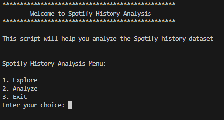
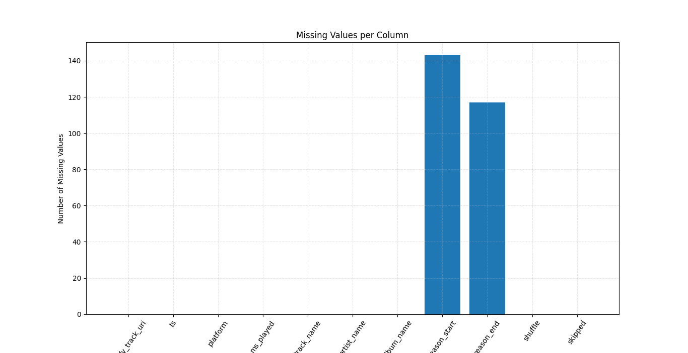
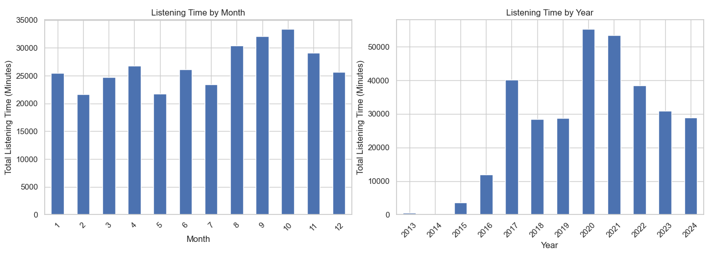
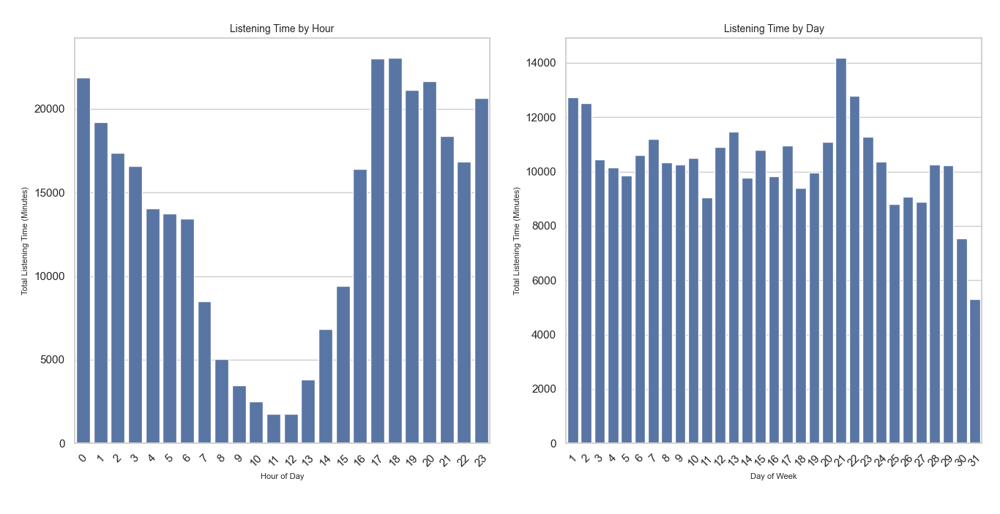
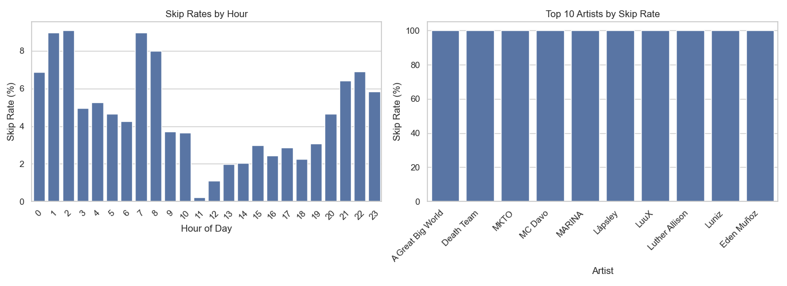
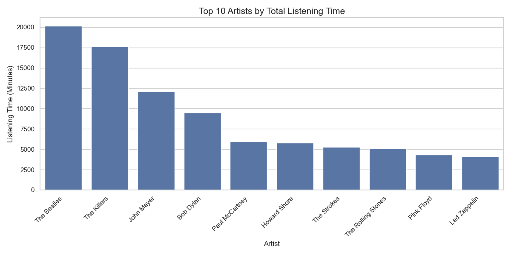

# Spotify History Analysis

## 📌 Project Overview

This project analyzes **Spotify streaming history** using **Python and Pandas**. It includes functions for **data cleaning, exploration, and visualization**, helping users understand their music listening patterns.

## 📂 Folder Structure

```
📁 spotify-history-analysis
│-- 📁 data
│   ├── data_manipulation.py  # Functions for handling data
│   ├── csv (folder)          # CSV dataset folder
│-- 📁 analysis
│   ├── 📁 interaction_patterns
│   │   ├── interaction.py   # Analysis of interaction patterns
│   ├── 📁 listening_behavior
│   │   ├── listening.py     # Insights on listening behavior
│   ├── 📁 temporal_trends
│   │   ├── temporal.py      # Temporal listening trends
│-- main.py                  # Main script with interactive menu
│-- README.md                # Documentation (You're reading this!)
|-- LICENSE                  # License
```

## 🛠️ Features

✅ Load and explore Spotify streaming history dataset\
✅ Identify missing values and fill them\
✅ Analyze **listening behavior** (most played artists, skip rates, platform usage)\
✅ Analyze **temporal trends** (monthly listening patterns, peak listening hours)\
✅ Analyze **interaction patterns** (shuffle vs non-shuffle, track start/end reasons)

## 📊 Data Visualization

- Bar charts for **missing values**
- Line plots for **year-over-year trends**
- Histograms for **hourly listening habits**
- Pie charts for **platform usage**

## 📌 How to Use

### 1️⃣ Install Required Packages

```bash
pip install pandas numpy seaborn matplotlib
```

### 2️⃣ Download and Run the Script

- **Cloning the repo**:

```bash
git clone https://github.com/Elthiero/Spotify-Streaming-History.git
cd Spotify-Streaming-History/
```

- **Run the script**:

```bash
python main.py
```

### 3️⃣ Navigate Through Menus

- **Explore**: View dataset details, handle missing values
- **Analyze**: Generate insights and visualizations

## 📸 Screenshots to of some charts













---

### 📌 License

This project is licensed under the **MIT License**. Feel free to use and modify!
